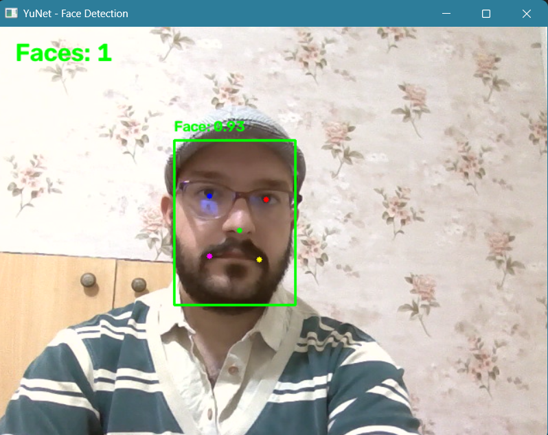

# YuNet Real-Time Face Detection with OpenCV

A lightweight real-time computer-vision application that uses a webcam, OpenCV, NumPy, and the **YuNet face detection model**.

> **Important attribution:** The YuNet model used by this project is **not original work by the repository author**. It is a third-party model obtained from the official OpenCV Zoo repository. The project does not claim ownership or authorship of the YuNet model or its underlying research.

## Demo



The application displays a live webcam stream with face detection results, confidence scores, five facial landmarks, face counting, and selectable image-processing modes.

## Features

- Real-time face detection using a webcam
- YuNet ONNX face detection model
- OpenCV `FaceDetectorYN` API
- Face bounding-box visualization
- Detection confidence display
- Five-point facial landmark visualization
- Real-time face counting
- Horizontal mirroring of the webcam stream
- Three display modes:
  - Normal
  - Sobel
  - Canny
- Runtime switching between display modes
- Current mode shown in the application window
- Mode-change messages printed in the terminal
- Configurable confidence threshold, NMS threshold, and Top-K
- Configurable camera resolution
- Screenshot capture with the `W` key
- Final application window with a top information bar and bottom controls bar

---

## Project Overview

This project demonstrates how a pre-trained face detection model can be integrated into a Python/OpenCV application.

The **Python application code, UI layout, configuration, image-processing logic, webcam handling, keyboard controls, screenshot functionality, and project-specific integration were developed for this project**.

The face detector itself is a third-party component:

- **Model:** YuNet
- **Model file:** `face_detection_yunet_2026may.onnx`
- **Source:** OpenCV Zoo
- **Model license:** MIT License
- **Model copyright notice:** Copyright (c) 2020 Shiqi Yu

The YuNet model is used for inference only. The repository does not claim authorship of the model or the original research.

---

## Technologies

- Python 3
- OpenCV
- NumPy
- OpenCV `FaceDetectorYN`
- ONNX
- YuNet
- Sobel edge detection
- Canny edge detection

---

## Third-Party Model and Attribution

This repository includes and uses the following third-party model:

```text
models/face_detection_yunet_2026may.onnx
```

The model is distributed through the **OpenCV Zoo** `face_detection_yunet` model directory.

Official sources:

- OpenCV Zoo – YuNet Face Detection:
  https://github.com/opencv/opencv_zoo/tree/main/models/face_detection_yunet
- YuNet training repository:
  https://github.com/ShiqiYu/libfacedetection.train
- YuNet face-detection repository:
  https://github.com/ShiqiYu/libfacedetection
- YuNet research paper:
  https://doi.org/10.1007/s11633-023-1423-y

The official OpenCV Zoo documentation states that the files in the YuNet model directory are licensed under the **MIT License**. The model-directory license identifies:

```text
Copyright (c) 2020 Shiqi Yu
```

Accordingly, this project explicitly preserves the third-party attribution instead of presenting the model as original project work.

### YuNet citation

If the model is referenced in academic work, cite the original YuNet research:

```bibtex
@article{wu2023yunet,
  title={YuNet: A Tiny Millisecond-level Face Detector},
  author={Wu, Wei and Peng, Hanyang and Yu, Shiqi},
  journal={Machine Intelligence Research},
  volume={20},
  number={5},
  pages={656--665},
  year={2023},
  publisher={Springer},
  doi={10.1007/s11633-023-1423-y}
}
```

---

## Installation

### 1. Clone the repository

```bash
git clone https://github.com/ali-esz/yunet-face-detection.git
cd yunet-face-detection
```

### 2. Create a virtual environment

On Windows:

```bash
python -m venv .venv
.venv\Scripts\activate
```

On macOS/Linux:

```bash
python3 -m venv .venv
source .venv/bin/activate
```

### 3. Install dependencies

```bash
python -m pip install -r requirements.txt
```

---

## Model File

The application expects the model at:

```text
models/face_detection_yunet_2026may.onnx
```

The model is included in the repository to make the project easier to reproduce.

Because the model is a third-party component, its license and attribution are separate from the license applied to the original project code. See the **Third-Party Model and Attribution** section above.

---

## Running the Application

Make sure a working webcam is connected.

Run:

```bash
python main.py
```

The application:

1. Opens the webcam.
2. Requests an `800 × 600` camera resolution.
3. Reads the actual camera resolution reported by the device.
4. Horizontally flips the frame to provide a mirror-like view.
5. Runs YuNet face detection.
6. Draws face bounding boxes, confidence values, and five landmarks.
7. Displays the number of detected faces.
8. Applies the selected display-processing mode.
9. Places the processed video inside the application layout.
10. Displays the result in an `800 × 600` OpenCV window.

The application starts in **Normal** mode.

---

## Keyboard Controls

The OpenCV window must have keyboard focus.

| Key | Action | Description |
| --- | --- | --- |
| `n` | Normal | Return to the normal camera display |
| `s` | Sobel | Apply Sobel edge processing |
| `c` | Canny | Apply Canny edge processing |
| `w` | Screenshot | Save the complete displayed window |
| `q` | Quit | Exit the application |

The current mode is shown in the top bar of the application window.

The bottom bar also displays the available controls.

### Screenshot

Pressing `w` saves the complete displayed `800 × 600` canvas, including:

- Top information bar
- Processed camera image
- Bottom controls bar

The screenshot filename contains a timestamp, for example:

```text
screenshot_20260911_165700_123456.png
```

Screenshots created in the project root by this feature are ignored by Git.

---

## Configuration

The main configuration values are defined in `main.py`:

```python
CONFIDENCE_THRESHOLD = 0.75
NMS_THRESHOLD = 0.30
TOP_K = 5000

CAMERA_INDEX = 0
CAMERA_WIDTH = 800
CAMERA_HEIGHT = 600

WINDOW_WIDTH = 800
WINDOW_HEIGHT = 600

TOP_BAR_HEIGHT = 60
BOTTOM_BAR_HEIGHT = 80
```

### Face Detection Parameters

`CONFIDENCE_THRESHOLD` controls the minimum confidence required for a detection.

`NMS_THRESHOLD` controls the detector's Non-Maximum Suppression threshold.

`TOP_K` controls the maximum number of candidate detections considered by the detector.

### Camera Parameters

`CAMERA_INDEX` selects the camera device.

The default is:

```python
CAMERA_INDEX = 0
```

The requested camera resolution is:

```text
800 × 600
```

The actual resolution depends on the webcam and operating-system camera driver.

### Display Layout

The final application window is:

```text
800 × 600
```

It consists of:

```text
┌──────────────────────────────────────────────┐
│                 Top Bar: 60 px               │
├──────────────────────────────────────────────┤
│                                              │
│              Camera / Video Area             │
│                  460 px high                 │
│                                              │
├──────────────────────────────────────────────┤
│              Bottom Bar: 80 px               │
└──────────────────────────────────────────────┘
```

---

## How It Works

The processing pipeline is:

```text
Webcam
   │
   ▼
Capture Frame
   │
   ▼
Horizontal Flip
   │
   ▼
YuNet Face Detection
   │
   ├── Bounding Box
   ├── Confidence Score
   └── Five Facial Landmarks
   │
   ▼
Face Count
   │
   ▼
Selected Display Processing
   │
   ├── Normal
   ├── Sobel
   └── Canny
   │
   ▼
Resize to Display Area
   │
   ▼
Top Bar + Video + Bottom Bar
   │
   ▼
Display / Optional Screenshot
```

### Face Detection

For each detected face, YuNet provides:

- Bounding-box coordinates
- Detection confidence
- Five facial landmark coordinates

The project visualizes these results directly on the camera frame.

### Important Processing Order

Face detection is performed on the normal camera frame.

The selected Sobel or Canny processing is applied **after** face detection and visualization. These modes are therefore display-processing modes; they are not preprocessing stages for YuNet and do not modify or improve the model's detection accuracy.

---

## Image-Processing Modes

### Normal

Normal mode displays the camera image with the face-detection results.

```text
Camera Frame
     │
     ▼
Horizontal Flip
     │
     ▼
YuNet Detection
     │
     ▼
Face Visualization
     │
     ▼
Normal Display
```

### Sobel

Sobel mode calculates horizontal and vertical image gradients:

```python
sobel_x = cv2.Sobel(processed_frame, cv2.CV_64F, 1, 0, ksize=3)
sobel_y = cv2.Sobel(processed_frame, cv2.CV_64F, 0, 1, ksize=3)
```

The gradient magnitude is calculated as:

```python
sobel_magnitude = np.sqrt(sobel_x**2 + sobel_y**2)
```

and converted for display:

```python
processed_frame = cv2.convertScaleAbs(sobel_magnitude)
```

### Canny

Canny mode converts the selected frame to grayscale and calculates thresholds from the median intensity:

```python
gray = cv2.cvtColor(processed_frame, cv2.COLOR_BGR2GRAY)
median_intensity = np.median(gray)

lower = int(max(0, 0.7 * median_intensity))
upper = int(min(255, 1.3 * median_intensity))
```

Then:

```python
canny_edges = cv2.Canny(
    gray,
    threshold1=lower,
    threshold2=upper
)
```

The generated edge mask is applied to the frame.

---

## Project Structure

```text
yunet-face-detection/
│
├── main.py
├── README.md
├── requirements.txt
├── LICENSE
├── .gitignore
│
├── models/
│   └── face_detection_yunet_2026may.onnx
│
└── screenshots/
    └── demo.png
```

### File Descriptions

| File / Directory | Description |
| --- | --- |
| `main.py` | Main Python application |
| `README.md` | Project documentation |
| `requirements.txt` | Python dependencies |
| `LICENSE` | MIT License for the original project code |
| `.gitignore` | Files excluded from Git |
| `models/` | Third-party YuNet model |
| `screenshots/` | Demonstration screenshots |

---

## Requirements

The project requires:

- Python 3
- `opencv-python==5.0.0.93`
- NumPy
- A working webcam
- The YuNet ONNX model in the `models/` directory

The selected OpenCV version is available on PyPI and provides the required `FaceDetectorYN` API used by this project.

---

## Testing and Limitations

The application is intended as a practical real-time computer-vision project rather than a formal benchmark.

Detection quality can vary with:

- Camera quality
- Lighting
- Face size
- Face orientation
- Occlusion
- Image resolution
- Hardware
- OpenCV version
- Camera drivers
- Runtime configuration

No specific detection accuracy or FPS is claimed unless measured under controlled conditions.

---

## Original Work vs. Third-Party Work

### Original Project Work

The following project-specific elements were developed for this repository:

- Webcam capture and configuration
- Application control flow
- YuNet integration
- Face-result visualization
- Confidence display
- Five-point landmark visualization
- Face counting
- Normal/Sobel/Canny mode switching
- Sobel processing
- Canny processing
- Top and bottom UI bars
- Runtime mode display
- Keyboard controls
- Screenshot saving
- Error handling
- Project documentation and organization

### Third-Party Work

The following is **not claimed as original project work**:

- YuNet model weights
- YuNet underlying model/research
- OpenCV itself
- NumPy

The YuNet model is attributed to its original source and authors above.

---

## License

### Original Project Code

The original code developed specifically for this project is released under the **MIT License**. See `LICENSE`.

### Third-Party Components

The YuNet model is a separate third-party component and remains subject to its own MIT License and attribution requirements.

This repository does **not** transfer or claim ownership of the third-party model.

For the exact third-party license terms, refer to the official OpenCV Zoo YuNet license:

https://github.com/opencv/opencv_zoo/blob/main/models/face_detection_yunet/LICENSE

---

## Author

**ali-esz**

GitHub:

https://github.com/ali-esz

---

## Acknowledgments

Special thanks to:

- **Shiqi Yu** and the contributors to the YuNet/libfacedetection work
- **Wu Wei, Hanyang Peng, and Shiqi Yu** for the YuNet research
- The **OpenCV Zoo** project and OpenCV maintainers

This project uses their work as a third-party component and does not claim authorship of the YuNet model.
